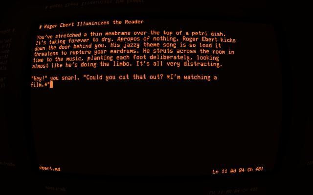

# Wry: A text editor for vampires

This is a rough draft of a program for writing rough drafts. It's
not really a text "editor," because it's strictly input-oriented.
The current line is always the last line in the buffer. You can't
go back and edit a previous line, and the only editing operations
consist of appending or deleting text. Any new lines you enter
will automatically be saved to disk. Word wrap is always enabled.

The only point of using this in the first place is to bang out a
few hundred (or thousand) words of text that hasn't been written
yet. This is an itch I was not able to scratch in other ways at
the time of writing. NaNoWriMo folks might find it useful. If
you're doing anything else, all bets are off.

## SCREENSHOTS

Editing a blogpost. Wry is running inside of [Cathode].

[Cathode]: http://www.secretgeometry.com/

## CONTROLS

- **Ctrl+W** deletes one word.

- **Ctrl+U** deletes all text on the current line.

- **Ctrl+H** and **Backspace** delete one character.

- **Ctrl+D** saves the text of the current line and quits.

## KNOWN BUGS

* The whole thing is very crude right now. In particular, word
  wrap will break on words longer than 65 characters. It displays
  wrong, and it might crash. Don't use words that long.

* There's no distinction between bytes and characters, so this is
  pretty much useless for any language other than English. I have
  no idea what will happen if you try it with Japanese.

* Error handling is sparse. No.

## PLANNED FEATURES

* Configurable status line formatting

* Tab completion

* Word frequency analysis (for sorting completion suggestions)

* A subset of Markdown formatting (**bold**, *italic*)

* UTF-8 support

## NOTES

"Wry" rhymes with "three," but you are allowed to rhyme it with
"try" unless you have renounced your humanity.

